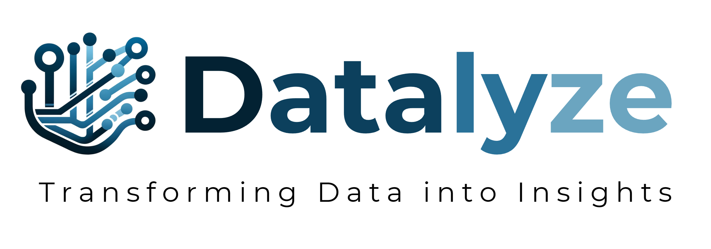

<p align="center">
  
</p>

<h1 align="center">Datalyze</h1>

<p align="center">
  <a href="https://www.python.org" target="_blank">  </a>
  <a href="https://streamlit.io/" target="_blank">  </a>
  <a href="https://pandas.pydata.org/" target="_blank">  </a>
  <a href="https://matplotlib.org/" target="_blank">  </a>
  <a href="https://seaborn.pydata.org/" target="_blank">  </a>
  <a href="https://scikit-learn.org/" target="_blank">  </a>
  <a href="https://optuna.org/" target="_blank">  </a>
  <a href="https://joblib.readthedocs.io/en/latest/" target="_blank">  </a>
</p>

Datalyze is a powerful no-code data analytics platform that simplifies the entire data science pipeline, from initial data ingestion to the development of sophisticated machine learning models. Built for analysts, data scientists, and business professionals alike, its intuitive web interface allows users to seamlessly conduct exploratory data analysis, perform automated data cleaning, and carry out robust feature engineering. With Datalyze, you can effortlessly build and optimize machine learning models in a single, integrated environment, transforming raw data into actionable insights without writing a single line of code.

---

## 🚀 Features

- **Data Import & Management**: Upload datasets in CSV or Excel format, with automatic data structure detection and data preview.
- **Exploratory Data Analysis (EDA)**: Automated data profiling, missing value analysis, descriptive statistics, and interactive visualizations. Export EDA reports in `.html` format.
- **Data Cleaning & Feature Engineering**: Modify feature types, handle missing values, remove duplicates, detect outliers, and perform feature selection.
- **Machine Learning & Model Optimization**: Configure datasets, train-test split, and normalization. Select regression or classification models, tune hyperparameters with the TPE method, and evaluate models. Export trained models in `.joblib` format.

---

## 🛠️ Tech Stack

Datalyze is built using the following technologies:
- **Python**: Core language for backend processing
- **Streamlit**: Web application framework
- **Pandas**: Data manipulation and analysis
- **Matplotlib & Seaborn**: Data visualization
- **Scikit-Learn**: Machine learning models Development
- **Optuna**: Hyperparameter optimization (TPE algorithm)
- **Joblib**: Model serialization and deployment

---

## 📖 Getting Started

You can run Datalyze either directly from the web or by setting it up locally on your machine.

### 1️⃣ Run Online

The easiest way to get started is by using the live web application, hosted on Streamlit Community Cloud.

🔗 **[Launch Datalyze App](https://datalyze-zkrjbtewkocqze5mt5gh55.streamlit.app/)**

### 2️⃣ Run Locally

For a local setup, ensure you have **Python 3.11** installed. Then, follow these steps:

1.  **Clone the repository:**
    ```bash
    git clone [https://github.com/azhar-anas/datalyze.git](https://github.com/azhar-anas/datalyze.git)
    cd datalyze
    ```

2.  **Install dependencies:**
    ```bash
    pip install -r requirements.txt
    ```

3.  **Run the application:**
    ```bash
    streamlit run App.py
    ```

---

## 📜 License

This project is licensed under the MIT License. See the `LICENSE` file for more details.
